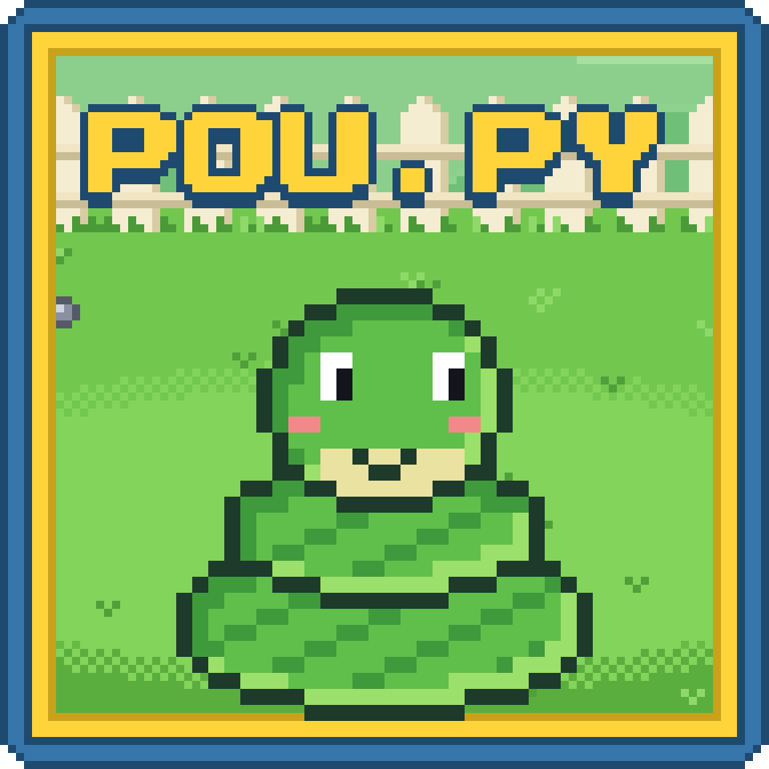

<p align="center">
  
</p>

<h1 align="center">POU.PY</h1>

Jogo de pet virtual feito em **Python + pygame**, inspirado em Pou e Tamagotchi. Cuide do seu bichinho: dê comida, dê banho e faça carinho para mantê-lo feliz.

O projeto nasceu para praticar lógica de programação e orientação a objetos.

## Como jogar

Ao abrir o jogo aparece o **menu**: com um save existente o botão é **Continuar**; sem save, **Jogar**, que leva à tela para dar um **nome** ao bichinho (até 12 caracteres, `Enter` confirma, `Esc` volta).

Dentro da partida, tudo é controlado com o mouse:

| Ação | Como fazer |
| --- | --- |
| Alimentar | Clique no botão da carne: ela cai em um ponto aleatório do cenário e o bichinho vai até ela |
| Dar banho | Clique no botão do sabão: a espuma gira em volta do bichinho até o banho acabar |
| Fazer carinho | Mantenha o botão esquerdo pressionado sobre o bichinho |

As barras no canto superior esquerdo mostram **fome**, **limpeza** e **felicidade**. O nome do bichinho aparece acima delas.

## Regras do jogo

- **Barras:** cada barra tem 8 marquinhas (valor máximo 150). Fome e limpeza caem 5 pontos a cada 6 segundos. A **felicidade** não é controlada diretamente: é a média entre fome e limpeza.
- **Carências:** quando uma barra chega a 3 marquinhas ou menos, o bichinho passa a reclamar, alternando entre as animações de fome, sujeira e tristeza (as que estiverem em alerta).
- **Comida:** até 3 carnes podem estar na tela ao mesmo tempo. O bichinho só se interessa por elas se a barra de fome **não estiver cheia**; ele vai até a mais próxima, mastiga por 4 segundos e a carne vira osso, recuperando 10 pontos de fome. Uma carne que ninguém come some sozinha após 10 segundos, e o osso após 5.
- **Banho:** só um banho por vez. Durante a animação (4 segundos) o bichinho para de andar; ao terminar, a limpeza sobe uma marquinha.
- **Carinho:** enquanto o botão do mouse estiver pressionado sobre o bichinho, ele para e toca a animação de afago.
- **Passeio:** a cada 5 segundos o bichinho sorteia um destino dentro da área do jardim e caminha até lá, a não ser que esteja comendo, tomando banho ou recebendo carinho.
- **Save:** o progresso (nome, fome e limpeza) é salvo ao iniciar a partida e ao fechar a janela, em JSON.

## Requisitos

- Python 3.10 ou superior
- [pygame](https://www.pygame.org/) 2.5 ou superior (instalado via `requirements.txt`)

## Instalação e execução

```bash
# 1. Clone o repositório
git clone <url-do-repositorio>
cd POUPY

# 2. Crie e ative um ambiente virtual
python -m venv .venv
source .venv/bin/activate        # Linux/macOS
.venv\Scripts\activate           # Windows

# 3. Instale as dependências
pip install -r requirements.txt

# 4. Execute o jogo (a partir da raiz do projeto)
python -m poupy
```

> O save `save_bixinho.json` é criado na raiz do projeto.

## Estrutura do projeto

```
POUPY/
├── poupy/                  # código do jogo
│   ├── __main__.py         # ponto de entrada
│   ├── jogo.py             # classe Jogo: estados, regras e game loop
│   ├── menu.py             # menu inicial, tela do nome e botões
│   ├── constantes.py       # constantes, carga de sprites/fontes e save/load
│   └── entidades/          # classes do jogo
│       ├── bixinho.py      # o pet (Poupy): ações, animações e movimento
│       ├── barras.py       # barras de fome, limpeza e felicidade
│       ├── comida.py       # carne (cai, é comida, vira osso e some)
│       ├── sabao.py        # espuma do banho
│       ├── mouse.py        # cursor (luva)
│       ├── botao_comida.py # botão da carne
│       └── botao_sabao.py  # botão do sabão
├── assets/
│   ├── sprites/            # imagens
│   ├── fontes/             # fonte Press Start 2P
│   └── musica/             # trilha sonora
├── requirements.txt
└── LICENSE
```

## Próximos passos (refactor)

- Tipar e documentar o restante do código, seguindo a PEP 8.

## Notas do criador

- Todos os sprites usados neste momento são temporários; os finais serão inseridos ao fim do projeto.

## Créditos

- Música: *Young Love* — BoxCat Games.
- Fonte: *Press Start 2P* (licença OFL, em `assets/fontes/OFL.txt`).

## Licença

Distribuído sob a licença descrita em [LICENSE](LICENSE).
